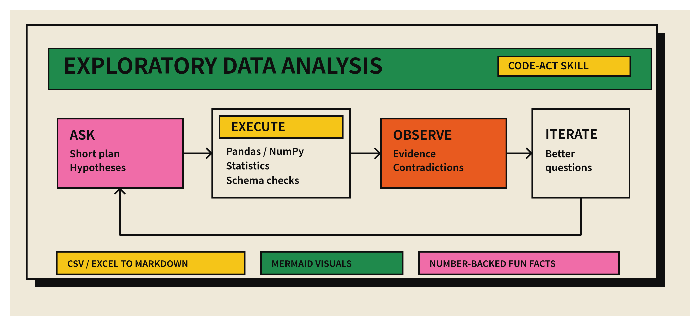
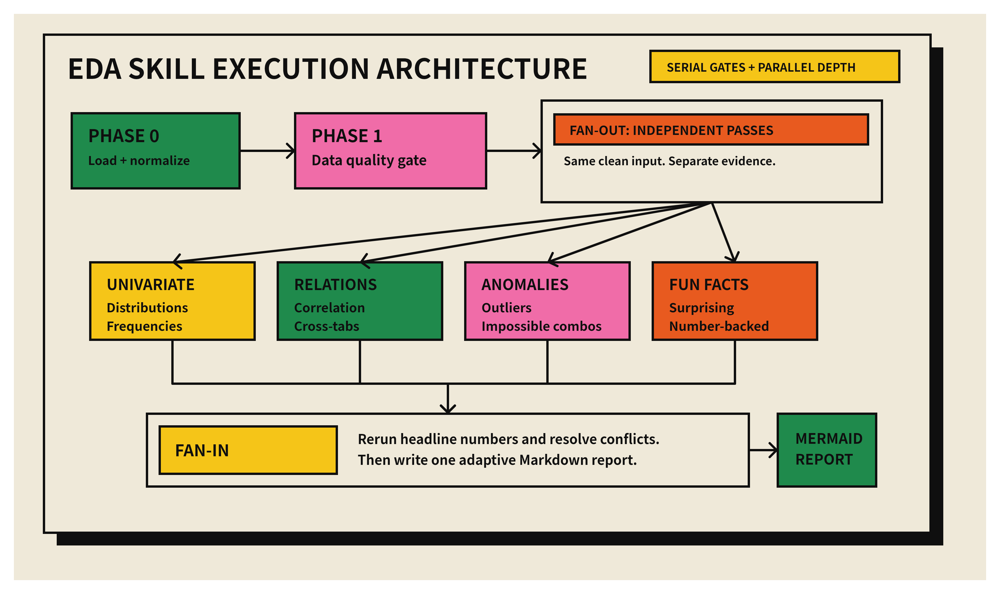

# Exploratory Data Analysis Skill

[中文说明](#中文说明) | [English](#exploratory-data-analysis-skill)



**A Codex skill for adaptive exploratory data analysis over CSV, Excel, TSV, and spreadsheet-like datasets.**

This skill turns a raw tabular file into an evidence-backed Markdown report. It uses a Code-Act loop rather than a rigid checklist: plan briefly, run Python analysis, observe the results, ask better questions, and synthesize the strongest findings.

## Why This Exists

Exploratory Data Analysis is not just "print `df.describe()`." Good EDA finds the shape of a dataset, catches quality traps, notices unexpected relationships, and explains what to investigate next. This skill gives Codex a reusable operating procedure for doing that work consistently.

## What It Does

- Loads CSV, TSV, Excel, and other tabular data with pandas.
- Builds a quick data dictionary: shape, types, sample rows, likely identifiers, dates, categories, measures, and text fields.
- Runs a serial data-quality gate before deeper analysis.
- Uses independent analysis passes for distributions, relationships, segments, anomalies, and fun facts when the task is broad enough.
- Produces Markdown reports, Feishu/Lark documents, or Feishu/Lark documents with htmlbox interactive charts.
- Requires claims to be supported by computed evidence: counts, denominators, percentages, ranges, examples, or caveats.

## Architecture



The workflow is intentionally split into serial gates and parallel exploration:

1. **Load and normalize** the source file without mutating the original.
2. **Audit data quality** before drawing conclusions.
3. **Fan out** independent exploration passes when they do not depend on each other.
4. **Fan in** by recomputing headline numbers, resolving contradictions, and writing one adaptive report.

## Install

Clone or download this repository into your Codex skills directory:

```bash
mkdir -p ~/.codex/skills
git clone https://github.com/chengjialu8888/Exploratory_Data_Analysis.git ~/.codex/skills/eda
```

Restart Codex so the skill metadata is reloaded.

## Use

Ask Codex something like:

```text
Use $eda to explore ./data/customers.xlsx and produce a Markdown report with Mermaid visuals.
```

Or:

```text
Use $eda on this CSV. I care most about missing values, segment differences, anomalies, and surprising findings.
```

For a Feishu/Lark visual report:

```text
Use $eda to analyze this Excel file and output the result as a Feishu document with htmlbox visualizations.
```

For longer EDA runs, append this progress expectation:

```text
每 10 分钟给我汇报进展，帮我校准预期，提前知会潜在卡点
```

Full example:

```text
Use $eda to analyze this Excel file and output the result as a Feishu document with htmlbox visualizations. 每 10 分钟给我汇报进展，帮我校准预期，提前知会潜在卡点
```

## Output

The final report should adapt to the dataset, but typically includes:

- Executive summary
- Dataset basics
- Data-quality notes
- Key patterns
- Relationships and segments
- Anomalies and edge cases
- Fun facts backed by numbers
- Recommended next steps
- Appendix with methods and assumptions

See [`references/report-contract.md`](references/report-contract.md) for the report interface and subtask output contract.

Supported final output formats:

| format | best for |
|---|---|
| Markdown | Portable reports, GitHub issues, local handoff |
| Feishu/Lark document | Shareable business-facing reports |
| Feishu/Lark document + htmlbox | Interactive ECharts dashboards, animated charts, rich visual analysis |
| Artifacts | Reproducible handoff with summaries and chart files |

See [`references/output-formats.md`](references/output-formats.md) for selection rules and the Feishu/htmlbox workflow.

## Repository Layout

```text
.
├── SKILL.md                       # Main Codex skill instructions
├── references/
│   ├── report-contract.md         # Final report and subtask contracts
│   └── output-formats.md          # Markdown, Feishu, htmlbox, and artifacts modes
├── agents/
│   └── openai.yaml                # UI metadata
├── assets/
│   ├── eda-concept.svg/png        # Philosophy header visual
│   └── eda-architecture.svg/png   # Workflow architecture visual
└── .github/                       # Issue and PR templates
```

## Design Principles

- **Evidence before prose**: every important conclusion should point back to a computed result.
- **Adaptive, not templated**: the report follows the dataset, not a fixed dashboard layout.
- **Quality gate first**: missingness, duplicates, parse failures, and suspicious values are checked before deep analysis.
- **Parallel only when independent**: use fan-out for low-coupling exploration, then fan-in for verification.
- **Privacy by default**: aggregate sensitive data unless row-level inspection is explicitly needed.

## Contributing

Contributions are welcome. Start with [`CONTRIBUTING.md`](CONTRIBUTING.md), and avoid committing private datasets or generated reports that contain sensitive information.

## License

MIT

---

# 中文说明

[Back to English](#exploratory-data-analysis-skill)


**一个面向 CSV、Excel、TSV 与表格型数据源的 Codex EDA Skill。**

这个 Skill 会把原始表格数据转化为一份有证据支撑的 Markdown 分析报告。它不是固定模板式流程，而是通过 Code-Act Loop 工作：先做短期规划，再运行 Python 分析，观察结果，提出更好的问题，最后综合最有价值的发现。

## 为什么需要它

EDA 不只是运行 `df.describe()`。好的探索性数据分析应该快速摸清数据结构，发现数据质量风险，捕捉意外关系，并指出下一步最值得深入的问题。这个 Skill 为 Codex 提供了一套可复用的分析操作规程。

## 核心能力

- 使用 pandas 读取 CSV、TSV、Excel 等表格数据。
- 建立快速数据字典：行列规模、字段类型、样例行、疑似 ID、日期、类别、数值指标与文本字段。
- 在深度分析前先执行串行的数据质量检查。
- 在任务足够宽泛时，用相互独立的分析 pass 探索分布、关系、分群、异常和 Fun Facts。
- 输出支持 Mermaid 图表的 Markdown 报告。
- 支持 Markdown、飞书文档、飞书文档 + htmlbox 互动图表等输出模式。
- 要求关键结论必须有计算证据支撑，例如计数、分母、百分比、范围、样例或限制说明。

## 架构


工作流被刻意拆成串行 gate 与并行探索：

1. **加载与标准化**：读取源文件，不修改原始数据。
2. **数据质量审计**：先检查缺失、重复、类型、异常值，再进入结论。
3. **并行展开**：当子任务互不依赖时，分别探索分布、关系、异常和趣味发现。
4. **统一综合**：重新计算关键数字，解决冲突，写成一份自适应报告。

## 安装

把仓库克隆到 Codex 的 skills 目录：

```bash
mkdir -p ~/.codex/skills
git clone https://github.com/chengjialu8888/Exploratory_Data_Analysis.git ~/.codex/skills/eda
```

重启 Codex，让 skill 元数据重新加载。

## 使用方式

可以这样对 Codex 说：

```text
Use $eda to explore ./data/customers.xlsx and produce a Markdown report with Mermaid visuals.
```

或者：

```text
Use $eda on this CSV. I care most about missing values, segment differences, anomalies, and surprising findings.
```

如果希望输出为飞书可视化报告：

```text
Use $eda to analyze this Excel file and output the result as a Feishu document with htmlbox visualizations.
```

如果是耗时较长的 EDA 任务，建议附带这句进展预期：

```text
每 10 分钟给我汇报进展，帮我校准预期，提前知会潜在卡点
```

完整示例：

```text
Use $eda to analyze this Excel file and output the result as a Feishu document with htmlbox visualizations. 每 10 分钟给我汇报进展，帮我校准预期，提前知会潜在卡点
```

## 输出内容

最终报告会根据数据集自适应调整，通常包含：

- 执行摘要
- 数据基本面
- 数据质量说明
- 关键模式
- 关系与分群
- 异常与边界情况
- 有数字支撑的 Fun Facts
- 推荐下一步探索方向
- 方法与假设附录

报告结构与子任务输出契约见 [`references/report-contract.md`](references/report-contract.md)。

支持的最终输出格式：

| 格式 | 适合场景 |
|---|---|
| Markdown | 本地报告、GitHub issue、文本交付 |
| 飞书/Lark 文档 | 面向业务或团队共享的分析报告 |
| 飞书/Lark 文档 + htmlbox | ECharts 互动图表、动态可视化、数据大屏式报告 |
| 分析 artifacts | 可复现交接，包含汇总文件与图表文件 |

输出模式选择规则与 Feishu/htmlbox 工作流见 [`references/output-formats.md`](references/output-formats.md)。

## 仓库结构

```text
.
├── SKILL.md                       # Codex skill 主说明
├── references/
│   ├── report-contract.md         # 最终报告与子任务输出契约
│   └── output-formats.md          # Markdown、飞书、htmlbox 与 artifacts 输出模式
├── agents/
│   └── openai.yaml                # UI 元数据
├── assets/
│   ├── eda-concept.svg/png        # 理念头图
│   └── eda-architecture.svg/png   # 流程架构图
└── .github/                       # Issue 与 PR 模板
```

## 设计原则

- **证据先于叙事**：每个重要结论都应回指到计算结果。
- **自适应而非套模板**：报告跟着数据走，而不是硬套固定版块。
- **质量检查优先**：缺失、重复、解析失败和可疑值必须先被看见。
- **只在独立时并行**：低耦合探索适合 fan-out，最终必须 fan-in 验证。
- **默认保护隐私**：除非明确需要行级排查，否则优先聚合展示敏感数据。

## 贡献

欢迎贡献。请先阅读 [`CONTRIBUTING.md`](CONTRIBUTING.md)，并避免提交私有数据集或包含敏感信息的生成报告。

## 许可证

MIT
