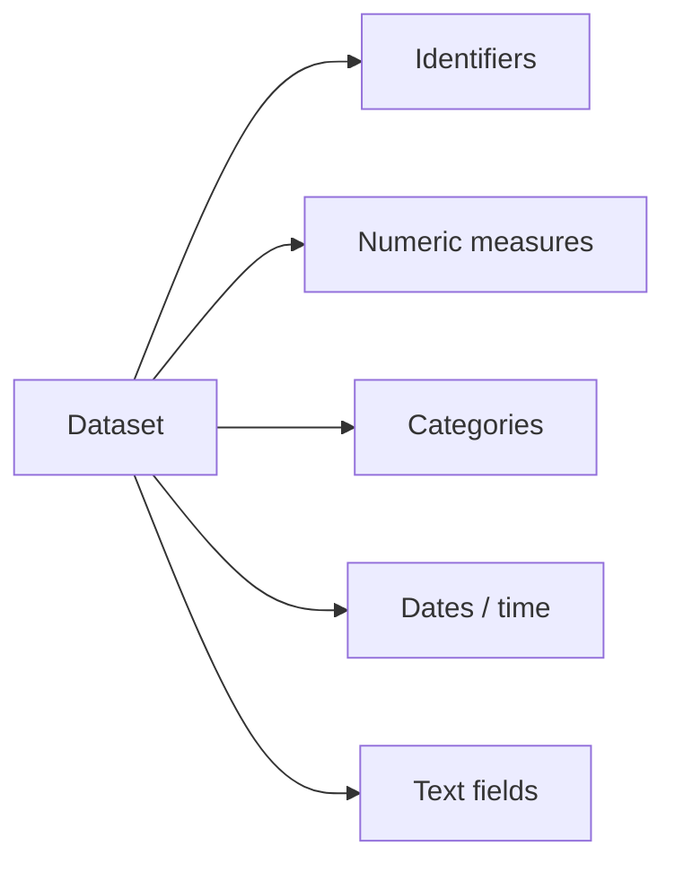
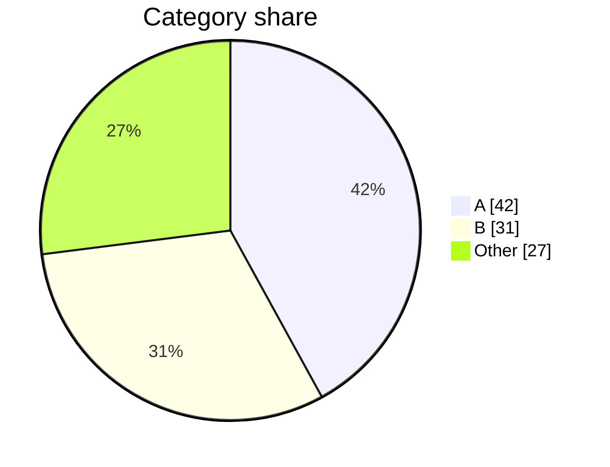

# EDA Report Contract

Use this reference when synthesizing the final Markdown report or specifying spawned subtask outputs.

## Subtask Output Contract

Each independent analysis pass should return:

```markdown
## <Subtask Name>

### What I Checked
- 2-5 bullets describing the actual computations.

### Findings
| finding | evidence | caveat |
|---|---:|---|
| Short claim | Exact number/rate/count | Limitation or assumption |

### Mermaid Candidates
- `<chart type>`: one sentence describing the data to encode.

### Follow-Up Questions
- 1-3 questions that would be worth testing next.
```

Subtasks should include file paths to any generated artifacts and should not modify the shared source data.

## Final Report Shape

Write a rich Markdown report with this general order, adapting section names to the dataset:

1. Executive Summary
2. Dataset Basics
3. Data Quality Notes
4. Key Patterns
5. Relationships And Segments
6. Anomalies And Edge Cases
7. Fun Facts
8. Recommended Next Steps
9. Appendix: Methods And Assumptions

Do not keep empty sections. If a dataset is small or simple, collapse sections.

## Output Format Options

Offer or infer one of these final result formats:

| option | use when | deliverable |
|---|---|---|
| `markdown` | User wants a portable text report, GitHub issue, local file, or no target is specified | A Markdown report with tables and Mermaid fences |
| `feishu-doc` | User wants a shareable Feishu/Lark document | A Feishu/Lark doc with structured sections, callouts, tables, and Mermaid/whiteboard blocks when useful |
| `feishu-doc-htmlbox` | User wants rich visualization, dashboards, animated charts, ECharts, or interactive exploration | A Feishu/Lark doc plus htmlbox blocks for verified interactive charts |
| `artifacts` | User wants reproducibility or handoff to analysts | Markdown report plus local CSV/JSON summaries, chart HTML files, and any generated images |

If the user explicitly asks for Feishu/Lark output, do not stop at local Markdown. Create or update the Feishu/Lark document and return the document URL.

## Required Evidence

Include at least:
- row and column counts
- column type summary
- top missingness issues
- duplicate assessment
- 3-7 strongest computed findings
- caveats that could change interpretation

For each major finding, provide one of:
- exact count and denominator
- percentage and denominator
- mean/median/range plus sample size
- top categories with counts
- date range and granularity
- representative row identifier when safe

## Mermaid Patterns

### Column Role Map



### Category Share



### Time Trend

```mermaid
xychart-beta
  title "Records over time"
  x-axis ["Jan", "Feb", "Mar"]
  y-axis "Records" 0 --> 100
  line [12, 45, 76]
```

## Feishu Doc Contract

When producing `feishu-doc` or `feishu-doc-htmlbox`:

- Create a document with a front-loaded callout summarizing the headline result and caveats.
- Use headings for the same adaptive sections as the Markdown report.
- Use tables for exact numeric summaries and compact comparisons.
- Use callouts for risks, caveats, and "do not over-interpret" warnings.
- Add at least one visual block for the core workflow, schema, or headline trend when the data supports it.
- Return the final document URL and mention any charts that could not be inserted.

## Htmlbox Visualization Contract

For `feishu-doc-htmlbox`, use the `feishu-cli-htmlbox` skill and its recipes. Treat each htmlbox as an executable artifact with this lifecycle:

1. Select chart type from the computed evidence:
   - trend over time -> ECharts line or area
   - category comparison -> bar or stacked bar
   - composition -> pie, treemap, sunburst, or stacked bar
   - distribution -> histogram, boxplot, scatter/bubble, heatmap, or calendar heatmap
   - flow or conversion -> funnel or Sankey
   - multivariate profile -> radar or parallel coordinates
   - executive summary -> KPI dashboard
2. Build the chart from aggregated data. Avoid embedding raw sensitive rows.
3. Write a self-contained HTML file with fixed chart height, responsive width, loading fallback, and `resize` handling.
4. Verify locally with `scripts/verify.sh <html> [wait_seconds]`; fix white screens, console/page errors, missing canvas/svg, and label problems before insertion.
5. Insert with `feishu-cli doc htmlbox create <doc_id> --html-file <html_file>`.
6. In the document, precede each htmlbox with a short heading and one sentence explaining what to look for.
7. Record generated chart file paths and inserted block IDs in the methods appendix when available.

Do not use htmlbox when a static table is clearer or when interaction would imply unsupported precision.

## Fun Facts Criteria

A fun fact must be:
- surprising or memorable
- specific, not generic
- supported by a computed number
- relevant to understanding the dataset

Good fun facts often come from:
- long-tail categories
- rare combinations
- sudden date spikes or gaps
- counterintuitive correlations
- one group dominating a metric
- violations of common assumptions

Avoid trivia that is merely a formatting artifact, a parsing error, or a tiny-sample coincidence unless framed as a data-quality warning.

## Final Checks

Before finishing:
- Recompute any headline number that came from a spawned subtask.
- Verify Mermaid syntax is fenced with `mermaid`.
- Make sure every caveat is visible near the finding it affects.
- State what was not analyzed because of time, missing data, permissions, or unclear schema.
