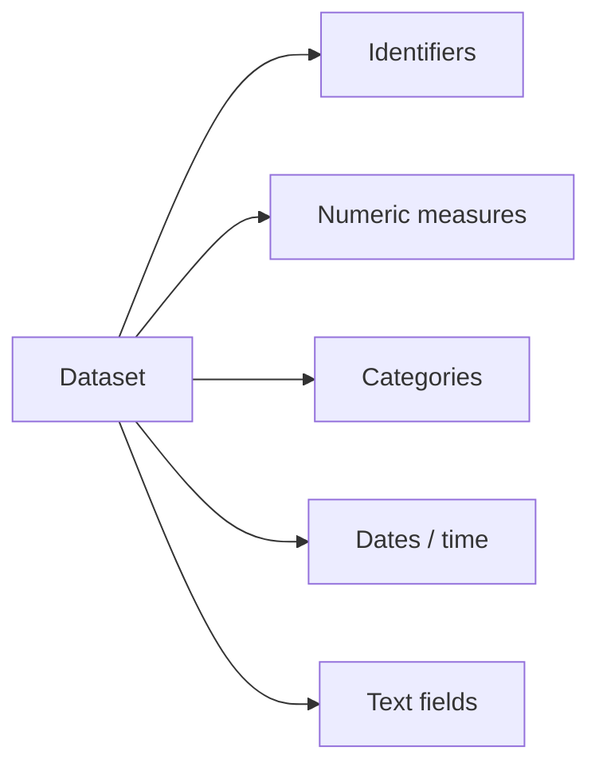
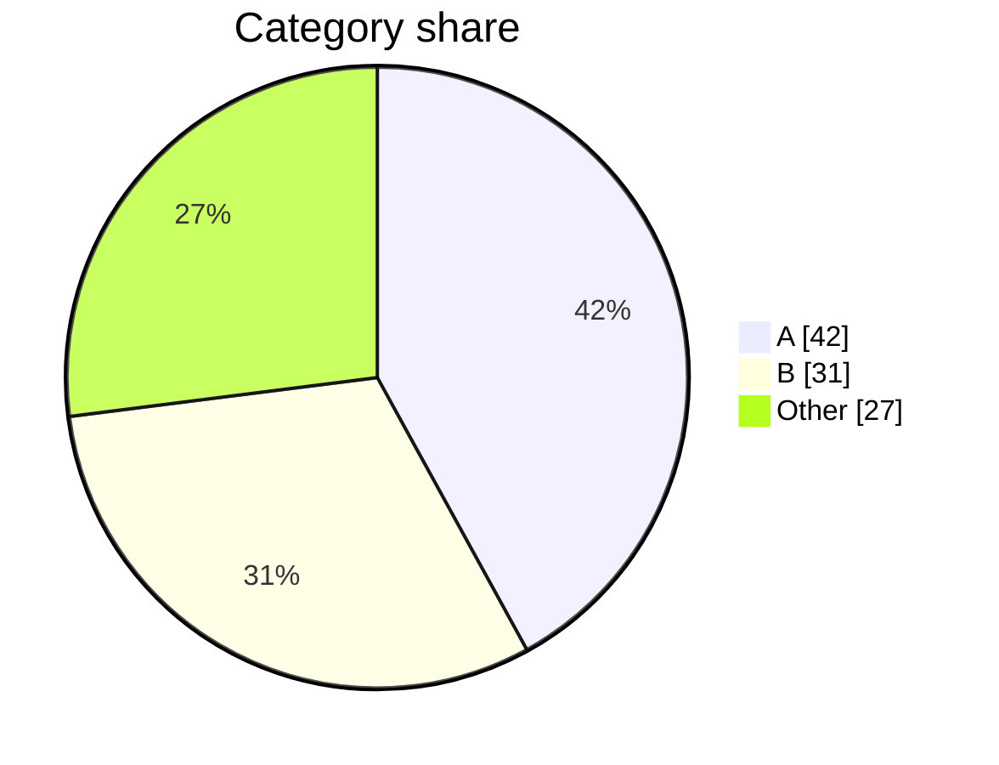

# EDA Report Contract

Use this reference when synthesizing the final Markdown report or specifying spawned subtask outputs.

## Subtask Output Contract

Each independent analysis pass should return:

```markdown
## <Subtask Name>

### What I Checked
- 2-5 bullets describing the actual computations.

### Findings
| finding | evidence | caveat |
|---|---:|---|
| Short claim | Exact number/rate/count | Limitation or assumption |

### Mermaid Candidates
- `<chart type>`: one sentence describing the data to encode.

### Follow-Up Questions
- 1-3 questions that would be worth testing next.
```

Subtasks should include file paths to any generated artifacts and should not modify the shared source data.

## Final Report Shape

Write a rich Markdown report with this general order, adapting section names to the dataset:

1. Executive Summary
2. Dataset Basics
3. Data Quality Notes
4. Key Patterns
5. Relationships And Segments
6. Anomalies And Edge Cases
7. Fun Facts
8. Recommended Next Steps
9. Appendix: Methods And Assumptions

Do not keep empty sections. If a dataset is small or simple, collapse sections.

## Required Evidence

Include at least:
- row and column counts
- column type summary
- top missingness issues
- duplicate assessment
- 3-7 strongest computed findings
- caveats that could change interpretation

For each major finding, provide one of:
- exact count and denominator
- percentage and denominator
- mean/median/range plus sample size
- top categories with counts
- date range and granularity
- representative row identifier when safe

## Mermaid Patterns

### Column Role Map



### Category Share



### Time Trend

```mermaid
xychart-beta
  title "Records over time"
  x-axis ["Jan", "Feb", "Mar"]
  y-axis "Records" 0 --> 100
  line [12, 45, 76]
```

## Fun Facts Criteria

A fun fact must be:
- surprising or memorable
- specific, not generic
- supported by a computed number
- relevant to understanding the dataset

Good fun facts often come from:
- long-tail categories
- rare combinations
- sudden date spikes or gaps
- counterintuitive correlations
- one group dominating a metric
- violations of common assumptions

Avoid trivia that is merely a formatting artifact, a parsing error, or a tiny-sample coincidence unless framed as a data-quality warning.

## Final Checks

Before finishing:
- Recompute any headline number that came from a spawned subtask.
- Verify Mermaid syntax is fenced with `mermaid`.
- Make sure every caveat is visible near the finding it affects.
- State what was not analyzed because of time, missing data, permissions, or unclear schema.
